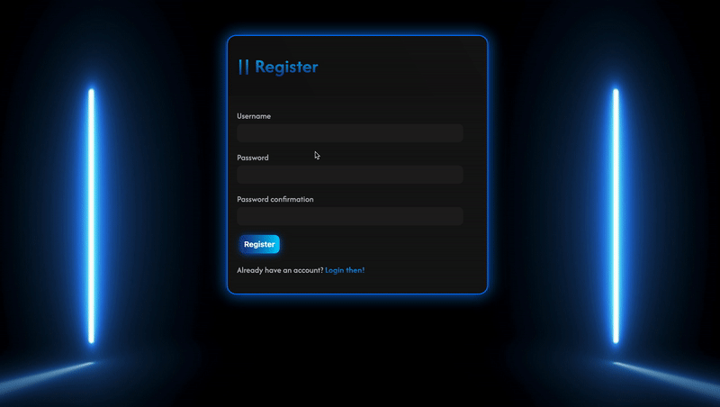
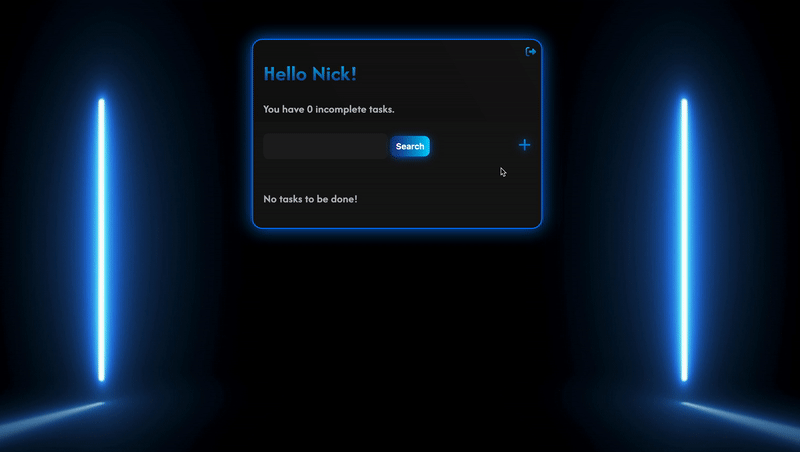
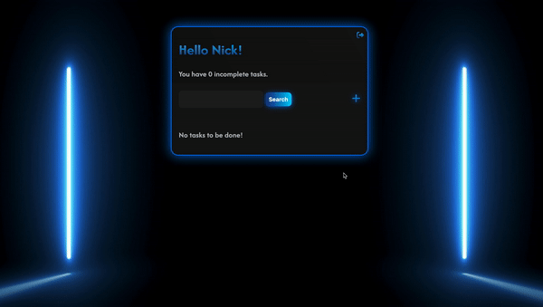
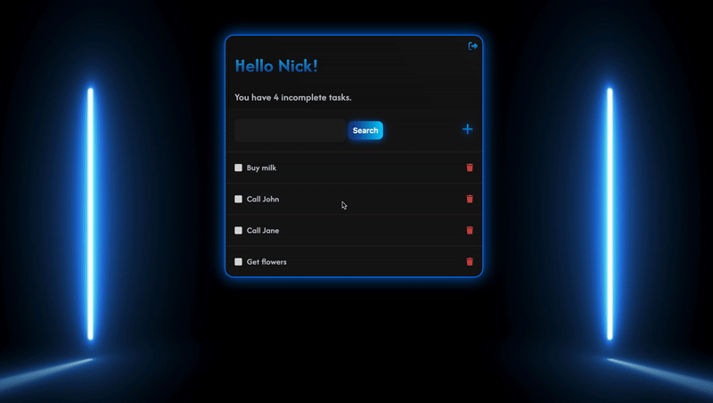

# NeoNote

A Django-based task management application.

## Table of Contents
- [Overview](#overview)
- [Features](#features)
- [Installation](#installation)
- [Usage](#usage)
- [Author](#author)

## Overview

NeoNote is a task management application built with Django. It allows users to create, update, and delete tasks, as well as register an account and log in to manage their tasks. It was created for the [Coding Factory](https://codingfactory.aueb.gr/), a 6-month full-stack educational program of Athens University of Economics and Business.

## Features

- User authentication (register, login, logout)
- Create, read, update, and delete tasks
- Task completion tracking
- Search functionality for tasks

## Installation

1. Clone the repository:

    ```bash
    git clone https://github.com/p3rception/NeoNote.git
    ```

2. Navigate to the project directory:

    ```bash
    cd NeoNote
    ```
3. (Optional) Create and activate a virtual environment.

    ```bash
    # Creation
    python -m venv venv
    
    # Activation
    source venv/bin/activate    # Unix
    venv\Scripts\activate.bat   # Windows
    ```

4. Install the required dependencies:

    ```bash
    pip install -r requirements.txt
    ```

5. Apply migrations:

    ```bash
    python manage.py makemigrations
    python manage.py migrate
    ```

6. Create a superuser to manage the Django admin interface:

    ```bash
    python manage.py createsuperuser
    ```

7. Run the development server:

    ```bash
    python manage.py runserver
    ```

8. Access the application at [http://localhost:8000](http://localhost:8000)

## Usage

### Register

### Login & Logout

### Create & Edit tasks

### Search & Delete tasks


## Author

Dimitris Pergelidis ([p3rception](https://github.com/p3rception))

## Disclaimer

The README.md template was created with the help of Bard, a language model from Google AI.
